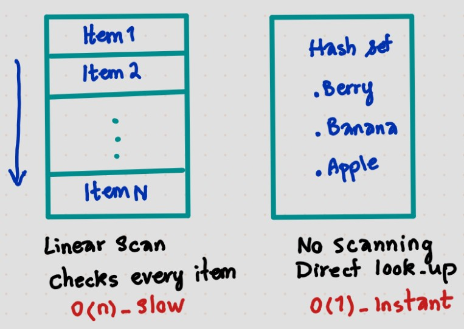

# Hash Maps & Sets

> **The sentence to say in an interview:**
> *I needed repeated membership queries, so I traded O(n) space for O(1) lookup and turned an
> O(n²) scan into O(n).*

---

## Hash Maps

Imagine you are looking for your doctor's office number in your contacts. You type the name in and
instantly see the result. The data structure behind the process is called a **hash map**.

With the help of hash maps we are able to find an element in the dataset in an instant, **O(1)**,
no matter if there are 10 or 10,000 elements inside. How cool is that? In the other classic data
structures like arrays and linked lists, searching for a value becomes more time-consuming as the
number of contacts in your notebook grows. If an array is not sorted, it takes **O(n)** to search
for an item.

### Structure

Every element in this data structure is a pair of **key** and **value**. In the doctor's contact
example:

| Key 🗝 | Value |
|---|---|
| `Dr. Geller` | `+49 166 000003` |



### How does it work?

There is a mathematical function behind it called the **hash function**, which maps the key to its
location. Inserting a new element maps the new key, using the hash function, to a new point in the
dataset. **Insert, delete and search are all O(1).**

> With the help of hash maps, **the size of a collection basically stops mattering.**

The idea is similar to when you reach for an index in an array. Hash maps use the same concept by
giving every key **a calculated address**.

### Collisions

There's a (not so common) potential for **collision** in hash maps though. When you insert two
different keys like `Map` and `Pam` that give the same result from the hash function, both entries
land in the same location. Collisions — *two keys, one slot* — are resolved by **chaining** or
**probing**. If you look for a key in a long chain, the search could reach **O(n)** in the worst
case.

### Duplicate keys overwrite

```python
d = {}
d["Dr. Geller"] = "+49 166 000003"
d["Dr. Geller"] = "+49 168 878702"
print(d)        # {'Dr. Geller': '+49 168 878702'} — one entry, overwritten
```

All modern **database indexes** are built on hash map principles. **Python dictionaries** and
**JavaScript objects** are both hash maps.

---

## Hash Sets


Now suppose values no longer matter and you just need to check if a value **exists** in your
dataset. Here comes the concept of the **hash set**.

To help you better understand hash sets, think of the club bouncer. The bouncer has a list of
guests, and when a new person arrives he only needs to know whether they are on the list — he
doesn't care about additional information like their table number.

When inserting a duplicate item into a hash set, it will just ignore it, as the membership check
already sees the element in the dataset. Delete, insert and search have the same **O(1)**
complexity.

### Hash set vs hash map

| | Hash set | Hash map |
|---|---|---|
| **Stores** | keys only | key–value pairs |
| **Used for** | checking membership | looking up the value of a key |

### Applications

- Which users have seen a notification
- Is the username already taken by another user
- Are there duplicates in the dataset

---

## Complexity

| Operation | Average | Worst |
|---|---|---|
| lookup `x in d` | O(1) | O(n) |
| insert `d[k] = v` | O(1) | O(n) |
| delete | O(1) | O(n) |
| `x in my_list` *(contrast)* | O(n) | O(n) |

---

## What signal in a problem tells me to reach for this?

- **"Have I seen this before?"** → duplicates, a `seen` set
- **Counting or frequency** → "most common element", anagrams, character counts
- **Complement lookup** → Two Sum: for each `x`, ask if `target − x` is already in the map
- **Grouping by a computed key** → group anagrams by sorted letters
- **Any nested loop that scans for a match** → the inner scan is almost always a hash map waiting
  to happen: **O(n²) → O(n)**

```python
seen = set()          # not seen = []
for x in nums:
    if x in seen:     # O(1) — with a list this would be O(n)
        return True
    seen.add(x)
```

---

## Common mistakes

- Using a **list** for membership tests — that's O(n) per check
- **Inserting before checking** (breaks the "no reuse" constraint, e.g. Two Sum with `[3,3]`)
- Forgetting that keys must be **hashable / immutable**
